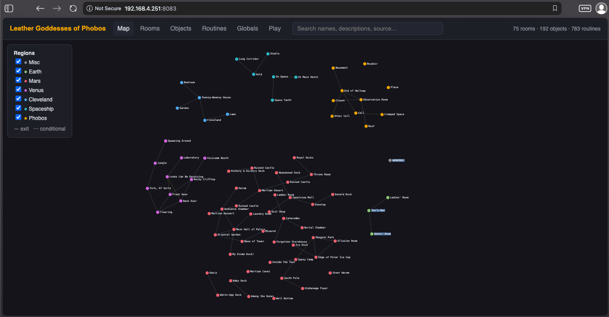
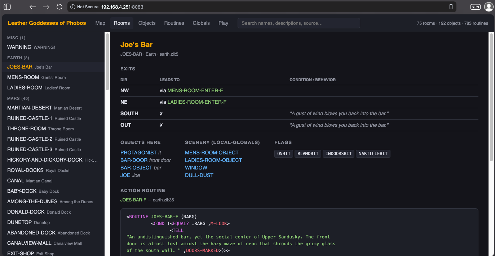
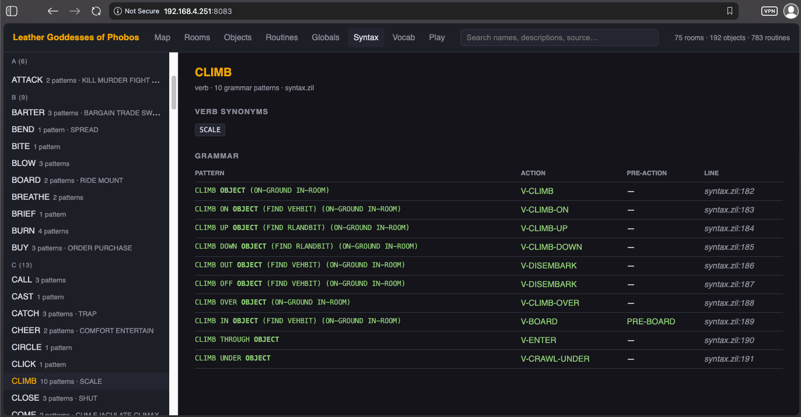
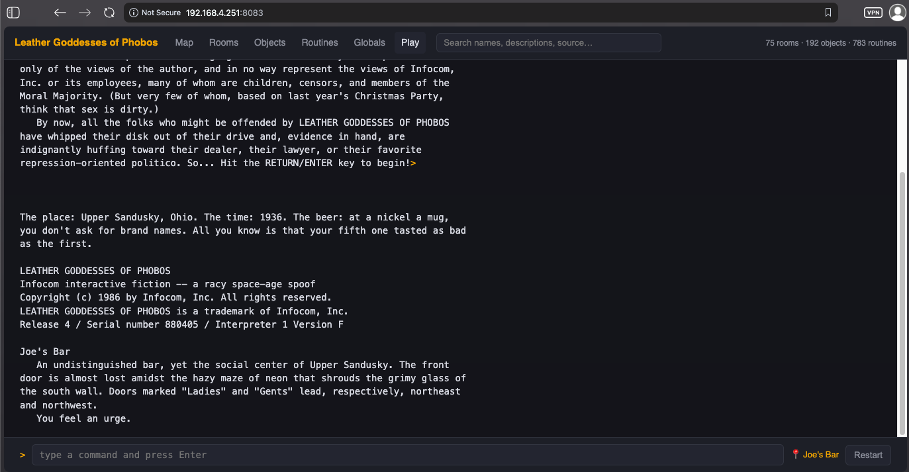

# Leather Goddesses of Phobos (Solid Gold Edition) — Source + Explorer

The complete ZIL source code of Steve Meretzky's 1988 Infocom classic,
wrapped in modern tooling: a browser-based world explorer, a playable
in-browser game backed by a real Z-machine interpreter, and a build
pipeline using the modern ZILF toolchain.

<p align="center">
  
  
</p>
<p align="center">
  
  
</p>

The original historical README claimed there was "no known way to compile"
this source. Today the modern ZILF toolchain (`zilf` + `zapf`) targets
exactly this dialect, and this repo carries what appear to be its
intermediates plus a compiled story file — but be honest about the record:
**a from-source build has never been verified in this repo's documented
history.** The included `COMPILED/x1.z5` and the `.zap` intermediates came
with the 2019 historicalsource archive import — off the Infocom drive
itself — and the story file identifies as **Release 4 / Serial 880405**,
the official Solid Gold release: an authentic Infocom ZILCH build, not a
modern reconstruction. What IS verified: the game runs, and the source is
fully browsable. (To attempt a modern compile yourself: install ZILF,
delete `COMPILED/x1.z5`, and run `bash tools/start.sh` — it rebuilds from
source and tells you how it went.)

## Requirements

- **python3** (3.7+, standard library only — no pip installs, no venv)
- **dfrotz** — the "dumb terminal" build of Frotz; needed only for the
  Play tab (everything else works without it)
  - Debian/Ubuntu: `sudo apt install frotz` (installs `/usr/games/dfrotz`)
  - macOS: `brew install frotz`
  - elsewhere: set `DFROTZ=/path/to/dfrotz` in the environment
- optional: the [ZILF](https://foss.heptapod.net/zilf/zilf) toolchain
  (`zilf` + `zapf`), only if you want to try rebuilding the story file
  from source — a compiled story file is already included

## Running it

**Step 1 — scan the ZIL source and build the world model:**

```
python3 tools/build_viewer.py
```

This parses all thirteen `.zil` files and extracts everything the explorer
navigates — rooms, objects, exits (with their conditions), routines with
their source text, globals, constants, the verb grammar, and the full
vocabulary — into `viewer/world.js`. It prints a summary when it's done:

```
rooms: 75  objects: 192  routines: 783  globals: 343  verbs: ...  words: ...
wrote .../viewer/world.js
```

A pre-generated `world.js` ships in the repo, so this step is only
*required* after you edit a `.zil` file — but run it once anyway to see
the pipeline work.

**Step 2 — start the server:**

```
python3 tools/server.py
```

**Step 3 —** browse to `http://<server-ip>:8083/`.

By default the server binds **0.0.0.0:8083** — reachable from every
machine on your network, not just localhost. To change either:

```
python3 tools/server.py --port 9000            # different port
python3 tools/server.py --bind 127.0.0.1       # localhost only
```

`bash tools/start.sh` does the same thing with guard rails: it checks
dfrotz is installed, rebuilds the story file from source if it's missing
(needs ZILF), refuses to start if the port is taken, and accepts the same
`--port`/`--bind` flags plus `--background` to daemonize (writes
`server.pid`/`server.log`; stop with `kill $(cat server.pid)`).

In-game saves land in `saves/`.

**RUNNING.md** is the always-current authority if these instructions
ever drift.

## What you get in the browser

| Tab | What it shows |
|---|---|
| **Map** | Force-directed graph of all 75 rooms, color-coded by region (Earth, Mars, Venus, Cleveland, Spaceship, Phobos). Dashed edges are conditional exits. Pan, zoom, click through to any room. |
| **Rooms** | Every room: description, exit table (destinations, `IF` conditions, blocking messages), objects present, scenery, flags, and its full syntax-highlighted ZIL action routine. |
| **Objects** | All 192 objects: location, synonyms/adjectives, flags, containment, action routines. |
| **Routines** | All 783 routines with cross-linked source — every known name in any listing is clickable, and each entity lists which routines reference it. |
| **Globals** | All globals and constants with their values. |
| **Syntax** | The verb grammar: every `<SYNTAX>` production with its action and pre-action routines, plus verb synonyms. |
| **Vocab** | Every word the game's parser knows, with all of its roles (verb, noun of which object, adjective, preposition, buzzword…). |
| **Play** | The actual game, running in `dfrotz` on the server, one session per browser. A live location chip tracks the room you're standing in — one click jumps from gameplay to that room's source code. |

## How it works

```
browser ── HTTP :8083 ──> tools/server.py ── pipes ──> dfrotz ── COMPILED/x1.z5
                              │
                              └── serves viewer/ (index.html + world.js)

*.zil ──> tools/build_viewer.py ──> viewer/world.js   (the parsed world model)
*.zil ──> zilf + zapf ──> COMPILED/x1.z5              (the playable story file)
```

- `tools/build_viewer.py` — a ZIL parser (Python, stdlib only) that extracts
  rooms, objects, exits, routines, globals, constants, verb grammar, and
  vocabulary into `viewer/world.js`. Rerun it after editing any `.zil`.
- `tools/server.py` — one server (Python, stdlib only): static files plus a
  JSON API (`/api/new`, `/api/send`, `/api/health`) driving per-session
  `dfrotz` subprocesses. Game saves land in `saves/`.
- `viewer/index.html` — the whole GUI, one self-contained file, no
  frameworks, no build step.

## The game source

Written in ZIL (Zork Implementation Language), a LISP/MDL dialect used by
Infocom. Layout: `x1.zil` is the main file; regions live in `earth.zil`,
`mars.zil`, `venus.zil`, `cleveland.zil`, `spaceship.zil`, `phobos.zil`;
the engine is `parser.zil`, `syntax.zil`, `verbs.zil`, `globals.zil`,
`misc.zil`; `hints.zil` is the Solid Gold in-game hint system. The `.zap`
files are compiler intermediates. The game's three content modes
(TAME/SUGGESTIVE/LEWD) are all in the source.

Numbers: 75 rooms · 192 objects · 783 routines · 166 globals ·
177 constants · ~480 grammar productions.

## Where this is going

See **ROADMAP.md**: differential verification against the official 1988
release, a source-level ZIL interpreter with live editing, an English→Zork
translation layer, and voice play. The guiding principles: one server, one
port; never guess what the source declares; the compiled game is the
oracle, the source is the deliverable.

## Provenance & license

The ZIL source is from the anonymously-contributed snapshot of Infocom's
development systems (the "historical source" archives) — canonical but not
necessarily identical to any shipped release. It is preserved here for
education, discussion, and historical research, and is **not under an open
license**; Leather Goddesses of Phobos is © 1986–1988 Infocom, Inc.
(Activision).

The tooling — everything under `tools/` and `viewer/` — is original work
of this repository and is **MIT licensed** (see `tools/LICENSE` and
`viewer/LICENSE`). The generated `viewer/world.js` contains game text and
data extracted from the ZIL source; the MIT grant covers the extraction
and viewer code, not that game content. There is deliberately no LICENSE
file at the repo root, so nobody mistakes the game itself for open-source.

Further reading:
[Wikipedia](https://en.wikipedia.org/wiki/Leather_Goddesses_of_Phobos) ·
[IFDB](https://ifdb.tads.org/viewgame?id=3p9fdt4fxr2goctw) ·
[IFWiki](http://www.ifwiki.org/index.php/Leather_Goddesses_of_Phobos)
